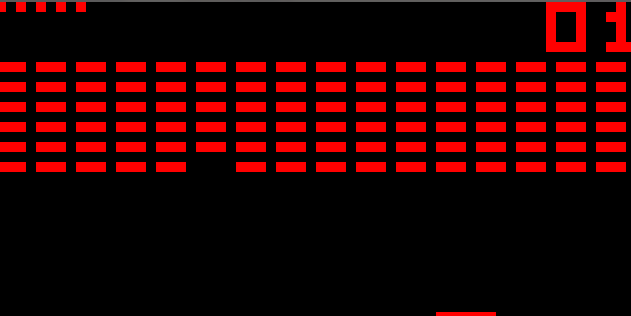

# CHIP-8 Interpreter

## Background
CHIP-8 is a simple interpreted programming language created in the 1970s to enable easier video game programming on the computers of that time. Programs are run on CHIP-8 virtual machines, which have been implemented on several different platforms, including the COSMAC VIP, the Telmac 1800, and the HP-48 graphing calculator.

This project is a CHIP-8 interpreter/virtual machine implemented in Haskell, using SDL for graphics, sound, and input.

## Usage
- Install [cabal](https://www.haskell.org/cabal/)
- Clone this repo
- CD to the root project directory
- Run `cabal run chip8 path/to/rom`

Some sample ROMs are provided in the `roms` directory.

## Example

